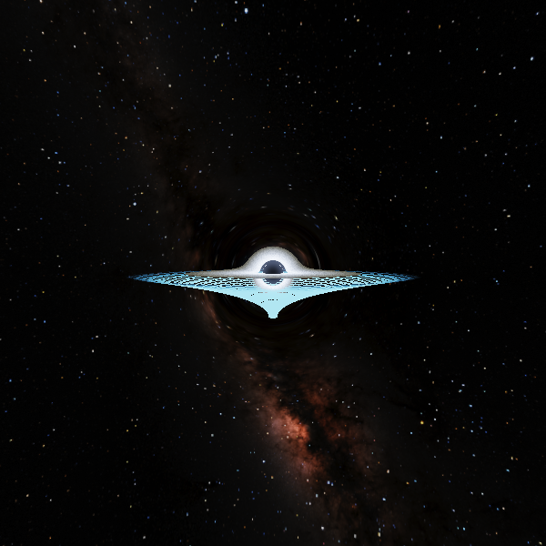

# Space Simulations

A C++ / OpenGL project visualizing the gravitational effects of a black hole.

Currently the simulation renders **2D gravitational lensing** — light rays traced through
Schwarzschild geometry, integrated with RK4 — alongside a **3D real-time ray marcher**
that integrates null geodesics per pixel on the GPU.



*Null geodesics integrated per pixel with velocity Verlet. The background is NASA's
starmap, warped by the curvature; the wireframe beneath is Flamm's paraboloid, the
isometric embedding of the equatorial spatial slice.*

---

## Features

- **2D Black Hole Simulation** (`sim2d`)
  - Gravitational lensing via numerical geodesic integration.
  - Interactive: click anywhere to spawn a light ray.
  - Fading ray trails and a deformable spacetime grid.
- **3D Black Hole Ray Marcher** (`sim3d`)
  - Per-pixel null geodesic integration in Schwarzschild spacetime.
  - Shakura-Sunyaev accretion disk with a Planck blackbody ramp and Keplerian shear.
  - Doppler beaming and gravitational redshift.
  - Flamm's paraboloid rendered as a curvature grid beneath the disk.
  - HDR pipeline: linear radiance, bloom, ACES tone mapping.
- **Modular codebase** — rendering, physics, and program flow kept separate.

---

## Project Structure

```
black_hole/
├── src/
│   ├── sim2d/              # 2D lensing simulation
│   │   ├── app2d.{h,cpp}       # Window, GL context, shader loading
│   │   ├── camera2d.{h,cpp}    # Input handling
│   │   ├── spacetime_grid.{h,cpp}
│   │   ├── lensing/ray.{h,cpp} # Light ray state & rendering
│   │   └── main.cpp            # Entry point (sim2d)
│   ├── sim3d/              # 3D simulation (WIP)
│   └── physics/
│       └── black_hole.{h,cpp}  # Schwarzschild radius, event horizon
├── shaders/                # GLSL sources — loaded at runtime
├── assets/
├── CMakeLists.txt
├── CMakePresets.json
└── vcpkg.json              # Dependency manifest
```

---

## Requirements

| | |
|---|---|
| Compiler | MSVC 2022 (C++17 or newer) |
| Build     | [CMake](https://cmake.org/download/) 3.21+ |
| Packages  | [vcpkg](https://github.com/microsoft/vcpkg) |
| GPU       | OpenGL 3.3 core profile |

Dependencies (`glew`, `glfw3`, `glm`) are declared in `vcpkg.json` and installed
**automatically** during configure — no manual `vcpkg install` needed.

---

## Setup

### 1. Install vcpkg

Skip if you already have it.

```bash
git clone https://github.com/microsoft/vcpkg.git
cd vcpkg
.\bootstrap-vcpkg.bat     # Windows
./bootstrap-vcpkg.sh      # Linux / macOS
```

### 2. Set `VCPKG_ROOT`

The build finds vcpkg through this environment variable. **This is the only
machine-specific setup step.**

```bat
setx VCPKG_ROOT C:\path\to\vcpkg
```

Close and reopen your terminal (or restart Visual Studio) so the variable takes effect.
Verify with `echo %VCPKG_ROOT%`.

### 3. Clone the project

```bash
git clone https://github.com/arahagikoa/space_sim.git
cd space_sim
```

---

## Building

### Command line

```bash
cmake --preset vs
cmake --build --preset debug
```

The first configure takes a few minutes while vcpkg builds the dependencies.
Subsequent runs are cached.

### Visual Studio

1. **File → Open → Folder…** and select the repository root.
2. Wait for CMake configuration to finish (watch the Output pane).
3. Pick **Visual Studio 2022** in the configuration dropdown.
4. Select **sim2d.exe** as the startup item.
5. Press **F5**.

> Alternatively, open the generated `build-vs\black_hole.sln`, right-click the
> `sim2d` target → *Set as Startup Project*.

---

## Running

```bash
cmake --build --preset debug --target sim2d
.\build-vs\bin\Debug\sim2d.exe
```

> **Run from the repository root.** Shaders are loaded from `./shaders/` at runtime
> using paths relative to the working directory. Launching the executable from
> inside `build-vs\bin\Debug\` will fail with *"Failed to open shader file"*.

### Controls

**`sim2d`**

| Input | Action |
|---|---|
| Left click | Spawn a light ray at the cursor |
| `Esc` | Quit |

**`sim3d`**

| Input | Action |
|---|---|
| Drag / scroll | Orbit, zoom |
| `G` | Spacetime curvature grid |
| `D` | Doppler beaming and redshift |
| `R` | Theoretical shadow edge at `b = √27/2 · r_s` |
| `-` / `=` | Exposure |
| `[` / `]` | Disk outer radius |
| `,` / `.` | Integrator steps |
| `1` / `2` | Black hole mass |
| `9` / `0` | Render resolution |
| `P` | Screenshot |
| `Esc` | Quit |

Screenshots are written next to the executable as `blackhole_<timestamp>.png`.

---

## Troubleshooting

**`Failed to open shader file: ./shaders/frag.frag`**
Working directory is wrong — see *Running* above. Under the Visual Studio debugger
this is handled by `VS_DEBUGGER_WORKING_DIRECTORY` in `CMakeLists.txt`.

**`CMAKE_TOOLCHAIN_FILE` errors, or vcpkg packages not found**
`VCPKG_ROOT` is unset or points at the wrong directory. Re-check step 2, then restart
your terminal / IDE.

**Visual Studio shows "No Configurations"**
Enable *Tools → Options → CMake → General → Always use CMake Presets*, then close VS,
delete the `.vs\` folder, and reopen.

**Stale configuration after switching branches**
```bash
rmdir /s /q build-vs
cmake --preset vs
```

**`sim3d` fails to compile**
Expected — it is unfinished. Build only `sim2d` (`--target sim2d`), or untick `sim3d`
in *Configuration Manager*.

---

## Roadmap

- [x] 2D gravitational lensing
- [x] 3D ray tracing for black hole visualization
- [x] Configurable parameters (mass, spin, observer position)
- [ ] Additional celestial objects and scene rendering
- [ ] Thruster / orbital mechanics simulation

---

## Inspiration

Heavily inspired by [this video](https://www.youtube.com/watch?v=8-B6ryuBkCM) on
implementing black hole simulations from scratch with ray tracing and physics-based
light bending.

---

## License

MIT — free to use, modify, and share.